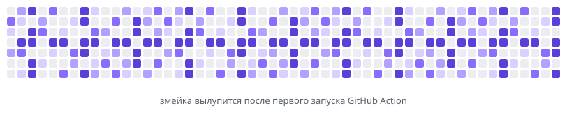

<!--
  Profile README for github.com/dzotyara.
  Everything in assets/generated/ is redrawn every day by .github/workflows/refresh.yml
  (scripts/build_profile.py + Platane/snk). To change the cards, edit data/*, not the SVGs.
-->

hey  I'm Nikita
===============================================================

<div align="center">




</div>

- 🤖 Right now I'm building **[Botyara](https://github.com/dzotyara/backseat)**, a Telegram & Discord group-chat member that remembers the whole conversation (and quotes it back at you)

- 💬 Ask me about **Telegram & Discord bots, LLM tooling, FastAPI backends, Discord Rich Presence and making logs readable**

- 🖥️ Fun fact: I made my Discord status show my [CPU, RAM and swap](https://github.com/dzotyara/discord_rpc_with_system_monitoring). The card above does the same for the GitHub runner that drew it

- 🎮 Rich Presence for games is a hobby too: see my [War Thunder RPC fork](https://github.com/dzotyara/WarThunderDiscordRPC_Fork)

- 📫 How to reach me: open an issue in any of my repos
<!-- Add your contacts here, e.g.
  [Telegram](https://t.me/<username>), [Discord](https://discord.com/users/<user_id>), [LinkedIn](https://linkedin.com/in/<username>)
-->

# Things I've Built

| | Project | What it does | Stack |
|---|---|---|---|
| 🤖 | **[backseat](https://github.com/dzotyara/backseat)** | Botyara: a Telegram & Discord group-chat bot with long-term memory, weekly digests and a web panel. 233 tests | aiogram · discord.py · OpenRouter · SQLite · Docker |
| 🧠 | **[Quizzard](https://github.com/dzotyara/Quizzard)** | Telegram quiz bot: any topic, three difficulty levels, questions streamed from an LLM, multiplayer | aiogram · SQLAlchemy · Alembic · Docker |
| 📜 | **[WebLoggy](https://github.com/dzotyara/WebLoggy)** | Turns Python logs into a live local web UI: pages, traces, search, Telegram/Discord alerts | Python · HTML · CSS · JS |
| ✅ | **[approval-service](https://github.com/dzotyara/approval-service)** | Approve / reject / cancel API with idempotency keys, an audit log, an outbox and workspace isolation | FastAPI · SQLAlchemy · Alembic · PostgreSQL |
| 🖥️ | **[discord_rpc_with_system_monitoring](https://github.com/dzotyara/discord_rpc_with_system_monitoring)** | CPU, RAM and swap right in your Discord status | pypresence · psutil |
| 🎨 | **[qwen-discord-bot](https://github.com/dzotyara/qwen-discord-bot)** | `/imagine` for Discord, powered by Qwen image generation | discord.py · DashScope |

# Some of My Favorite Tools

[](https://skillicons.dev)

# My settings.json

```jsonc
// same format as my Discord RPC monitor
{
    "client_id": "dzotyara",
    "name": "Nikita",
    "update_interval": 5,
    "monitoring_1": "bots_online",     // Botyara, Quizzard, /imagine
    "monitoring_2": "tests_passed",    // 233 in backseat alone
    "monitoring_3": "coffee_percent",
    "monitoring_4": "swap_percent",    // brain swap, mostly regex
    "stack": ["Python", "aiogram", "discord.py", "FastAPI", "SQLAlchemy", "Docker"],
    "favorites": {
        "language": "Python",
        "database": "SQLite, until it isn't",
        "license": "MIT",
        "game": "War Thunder",
        "emoji": "🤖"
    }
}
```

<div align="center">

<h3>Botyara's comment of the day</h3>



<h3>My contributions, as eaten by a snake</h3>

<picture>
  <source media="(prefers-color-scheme: dark)" srcset="assets/generated/snake-dark.svg">
  <source media="(prefers-color-scheme: light)" srcset="assets/generated/snake-light.svg">
  
</picture>

<sub>The cards on this page are redrawn every day by <a href=".github/workflows/refresh.yml">a GitHub Action</a> and <a href="scripts/build_profile.py">a small Python script</a>.</sub>

</div>
